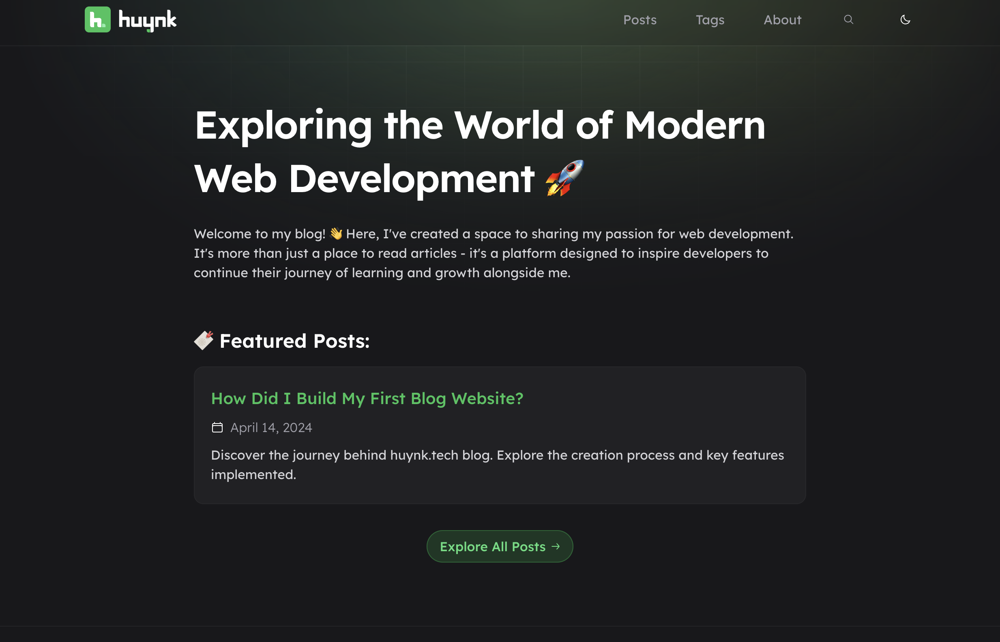
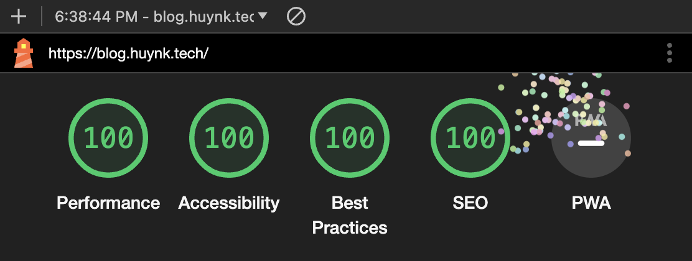

# Blog huynk.tech 📃

Blog [huynk.tech](https://blog.huynk.tech) is my personal blog, built with Astro. I've created this blog to impart my insights on web development and inspire developers to continue their journey of learning and growth alongside me.

## 📝 Key Features

Here are some key features of this blog:
- Fully responsive and accessible
- SEO-friendly
- Fast performance
- View transitions
- Sitemap & RSS feed
- Light & dark mode
- Fuzzy search
- Posts pagination
- Interactive table of contents
- Comments with Github Discussions
- Share posts to Facebook, Linkedin, Twitter

## 💯 Lighthouse Score

## 💻 Tech Stack

- [Astro](https://astro.build/) - Main framework
- [React](https://react.dev/) - Interactive component
- [TailwdindCSS](https://tailwindcss.com/) - Styling
- [MDX](https://mdxjs.com/) - Blog content
- [Netlify](https://www.netlify.com/) - Deployment

## 👀 Feedback

If you have any feedback, you can contact me via kimhuy011199@gmail.com.
Alternatively, feel free to open an issue if you find bugs or want to request new features.

